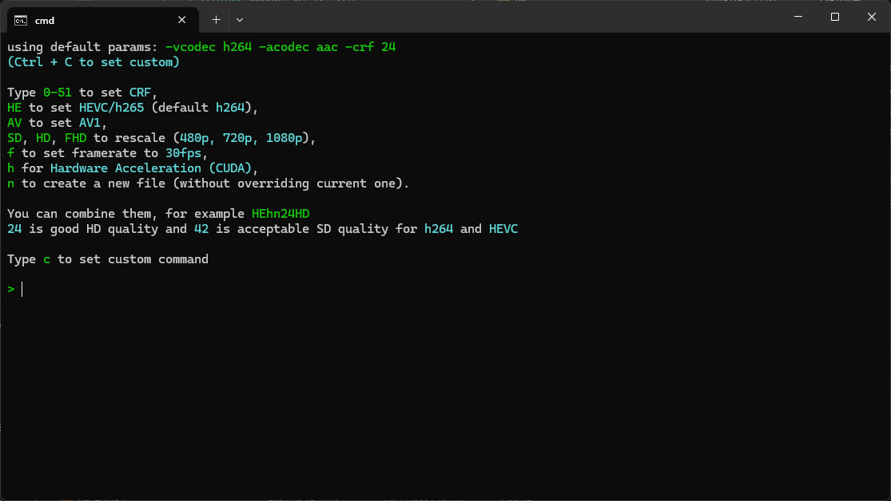
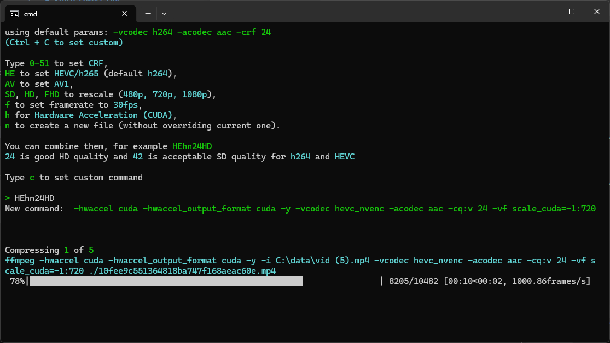
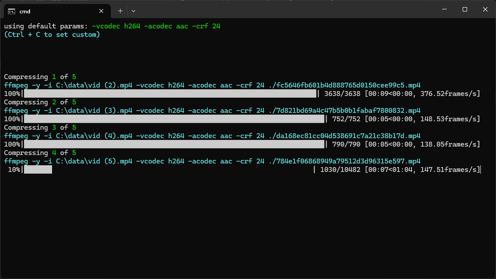

# Video Compressor

## Description

### This is an FFMPEG wrapper to easily bulk compress/transcode videos.

## How to use

### Windows
Drag and drop a directory or single / multiple video files or a directory into `compressor.bat`. The videos will be replaced.

You can also link `compressor.bat` into `%USERPROFILE%\AppData\Roaming\Microsoft\Windows\SendTo` to link it to right click `Send To`.
Open that path by running `python.exe .\main.py --sendto`

### All platforms

If you open the program directly, there will be a video selection dialog.

For non-windows ensure you have ffmpeg in `PATH` or in repo directory

### CLI

VideoCompressor supports command line parameters:
- `-24HE` or similar (check VideoCompressor's parameters menu) to automatically start compressing with selected parameters
- `--sendto` opens SendTo directory for a handy access to saved presets

In `CustomPreset.bat` you can see the implementation. Create a link to these files in `SendTo` to add these presets to your context menu.

## Additional info

**Warning! It overwrites the original video files, so ensure your compressions settings are right!** Alternatively use `n` command to create a new file.

Defaults to h264 mp4 with CRF 24.
You can set your own CRF, output scale, video codec, enable hardware acceleration, or type the whole ffmpeg command. Now supports nvidia GPU and fully supports H264, H265/HEVC and AV1 both on CPU and GPU.

Program is failsafe, as it doesn't override the files unless they're fully transcoded. If there's any error with transcoding, file doesn't get removed.

You can see each ffmpeg command above each file's progress bar. If you want to use the ffmpeg command somewhere else, just copy that cyan text.